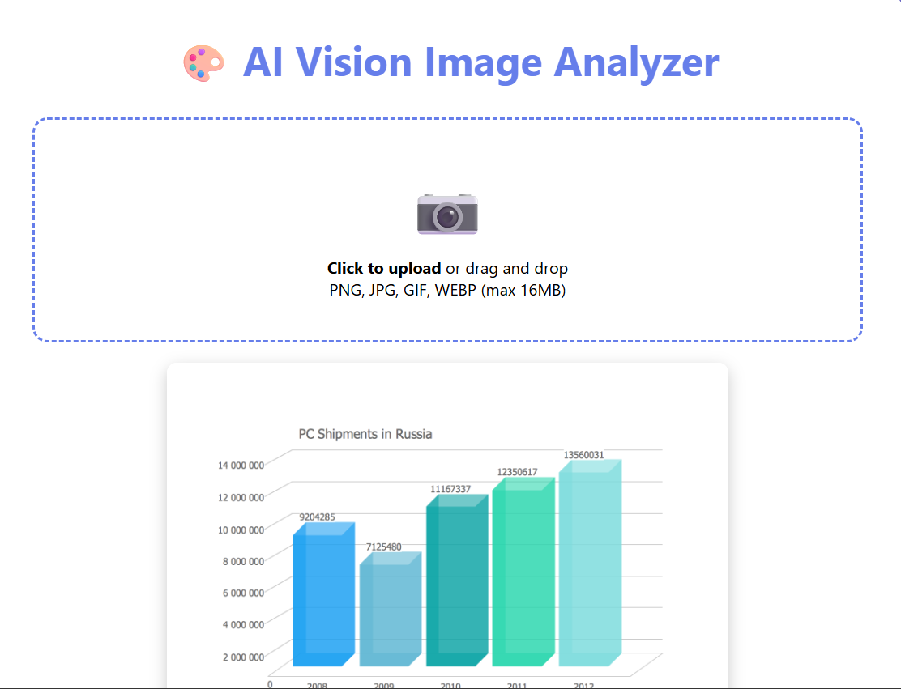
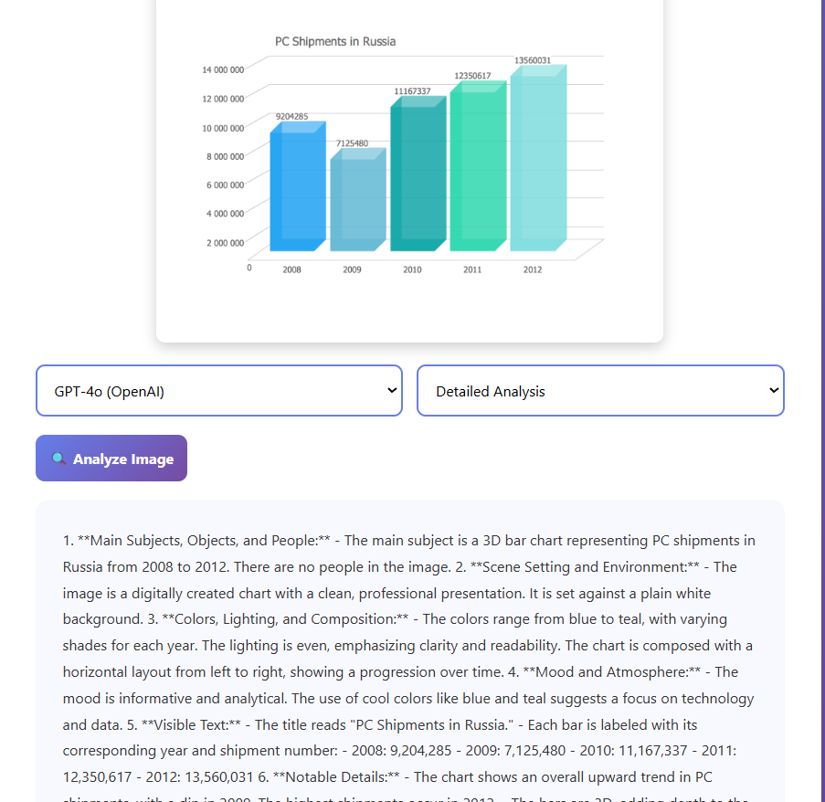

# 🎨 VisionForge

**Multi-Model AI Vision Image Analyzer**

VisionForge is a powerful image analysis tool that leverages multiple state-of-the-art AI vision models (GPT-4o, Claude Sonnet 4.5, and Gemini Vision) to provide comprehensive insights about your images. Available as both a beautiful web application and a flexible Python library.





## ✨ Features

### 🌐 Web Application
- **Beautiful, Modern UI** - Gradient design with drag-and-drop upload
- **Real-time Analysis** - Instant AI-powered image insights
- **Multiple AI Models** - Choose between GPT-4o and Claude Sonnet 4.5
- **4 Analysis Modes**:
  - **Detailed Analysis** - Comprehensive breakdown of image elements
  - **Story Generation** - Creative narratives based on your image
  - **Technical Analysis** - Professional photography and composition insights
  - **Creative Analysis** - Artistic interpretation and symbolism

### 🐍 Python Library
- **Unified API** - Single interface for multiple vision models
- **Model Comparison** - Run the same image through all models simultaneously
- **Flexible Prompting** - Custom prompts or predefined analysis types
- **Export Results** - Save analyses to JSON for further processing
- **Support for GPT-4o, Claude Sonnet 4.5, and Gemini Vision**

## 🚀 Quick Start

### Installation

```bash
# Clone the repository
git clone https://github.com/yourusername/visionforge.git
cd visionforge

# Install dependencies
pip install flask openai anthropic google-generativeai pillow
```

### Set Up API Keys

```bash
# Linux/Mac
export OPENAI_API_KEY='your-openai-key-here'
export ANTHROPIC_API_KEY='your-anthropic-key-here'
export GOOGLE_API_KEY='your-google-key-here'

# Windows (Command Prompt)
set OPENAI_API_KEY=your-openai-key-here
set ANTHROPIC_API_KEY=your-anthropic-key-here
set GOOGLE_API_KEY=your-google-key-here

# Windows (PowerShell)
$env:OPENAI_API_KEY="your-openai-key-here"
$env:ANTHROPIC_API_KEY="your-anthropic-key-here"
$env:GOOGLE_API_KEY="your-google-key-here"
```

### Run the Web Application

```bash
python app.py
```

Then open your browser to: **http://localhost:5000**

## 📖 Usage

### Web Application

1. **Upload an Image**
   - Click the upload area or drag and drop
   - Supports PNG, JPG, GIF, WEBP (max 16MB)

2. **Select Your Preferences**
   - Choose AI model (GPT-4o or Claude)
   - Pick analysis type (Detailed, Story, Technical, Creative)

3. **Analyze**
   - Click "Analyze Image"
   - Wait for AI-powered insights
   - Read and use the generated analysis

### Python Library

#### Basic Usage

```python
from vision_analyzer import VisionAnalyzer

# Initialize (uses environment variables for API keys)
analyzer = VisionAnalyzer()

# Analyze with GPT-4o
result = analyzer.analyze_with_gpt4o(
    image_path="path/to/image.jpg",
    analysis_type="detailed"
)
print(result)

# Analyze with Claude
result = analyzer.analyze_with_claude(
    image_path="path/to/image.jpg",
    analysis_type="story"
)
print(result)

# Analyze with Gemini
result = analyzer.analyze_with_gemini(
    image_path="path/to/image.jpg",
    analysis_type="technical"
)
print(result)
```

#### Advanced Usage

```python
# Custom prompt
custom_analysis = analyzer.analyze_with_claude(
    image_path="path/to/image.jpg",
    custom_prompt="Describe the emotions conveyed in this image and explain the color psychology used."
)

# Compare all models
comparison = analyzer.compare_models(
    image_path="path/to/image.jpg",
    analysis_type="creative"
)

# Save results
analyzer.save_results(comparison, "my_analysis.json")
```

#### Providing API Keys Directly

```python
# Initialize with explicit API keys
analyzer = VisionAnalyzer(
    openai_key="your-key",
    anthropic_key="your-key",
    google_key="your-key"
)
```

## 🎯 Analysis Types

### Detailed Analysis
Comprehensive examination including:
- Main subjects and objects
- Scene setting and environment
- Colors, lighting, and composition
- Mood and atmosphere
- Visible text
- Notable details
- Context and purpose

### Story Generation
Creative storytelling featuring:
- Current scene description
- Character backgrounds
- Emotional narratives
- Future predictions
- Vivid imagery

### Technical Analysis
Professional photography insights:
- Composition techniques
- Lighting setup and quality
- Color grading
- Depth of field
- Camera settings estimation
- Post-processing techniques

### Creative Analysis
Artistic interpretation covering:
- Style and influences
- Symbolism and metaphors
- Emotional impact
- Cultural context
- Multiple interpretations

## 🔧 Configuration

### File Size Limits
The web app has a 16MB file size limit. Modify in `app.py`:

```python
app.config['MAX_CONTENT_LENGTH'] = 16 * 1024 * 1024
```

### Supported Formats
- PNG
- JPG/JPEG
- GIF
- WEBP

### Model Configuration

#### GPT-4o
- Model: `gpt-4o`
- Max tokens: 2000
- Temperature: 0.7

#### Claude Sonnet 4.5
- Model: `claude-sonnet-4-5-20250929`
- Max tokens: 2000

#### Gemini Vision
- Model: `gemini-1.5-flash`

## 📁 Project Structure

```
visionforge/
│
├── app.py                  # Flask web application
├── vision_analyzer.py      # Python library
├── templates/
│   └── index.html         # Auto-generated HTML template
├── uploads/               # Temporary upload storage
└── README.md              # This file
```

## 🌟 Use Cases

- **Content Creation** - Generate descriptions for social media posts
- **Photography Analysis** - Learn from professional composition techniques
- **Accessibility** - Create alt-text for images
- **E-commerce** - Automated product descriptions
- **Education** - Teach visual literacy and art appreciation
- **Research** - Analyze large image datasets
- **Creative Writing** - Generate story ideas from images
- **Marketing** - Analyze visual content effectiveness

## 🛡️ Security Notes

- Never commit API keys to version control
- Use environment variables for sensitive data
- The web app deletes uploaded images after processing
- Implement rate limiting for production deployments

## 📋 Requirements

```
flask>=3.0.0
openai>=1.0.0
anthropic>=0.18.0
google-generativeai>=0.3.0
pillow>=10.0.0
werkzeug>=3.0.0
```

## 🤝 Contributing

Contributions are welcome! Please feel free to submit a Pull Request.

1. Fork the repository
2. Create your feature branch (`git checkout -b feature/AmazingFeature`)
3. Commit your changes (`git commit -m 'Add some AmazingFeature'`)
4. Push to the branch (`git push origin feature/AmazingFeature`)
5. Open a Pull Request

## 📝 License

This project is licensed under the MIT License - see the LICENSE file for details.

## 🔗 API Documentation

### OpenAI GPT-4o Vision
- [Documentation](https://platform.openai.com/docs/guides/vision)
- [API Reference](https://platform.openai.com/docs/api-reference)

### Anthropic Claude
- [Documentation](https://docs.anthropic.com/claude/docs)
- [Vision Guide](https://docs.anthropic.com/claude/docs/vision)

### Google Gemini
- [Documentation](https://ai.google.dev/docs)
- [Python SDK](https://ai.google.dev/tutorials/python_quickstart)

## 🐛 Troubleshooting

### "API key not found" error
Ensure your environment variables are set correctly before running the application.

### "Module not found" error
Install all dependencies: `pip install -r requirements.txt`

### Image upload fails
Check that your image is under 16MB and in a supported format.

### Model timeout
Large images or complex prompts may take longer. Consider reducing image size or simplifying prompts.

## 💡 Tips for Best Results

1. **Image Quality** - Use high-resolution images for detailed analysis
2. **Specific Prompts** - More specific custom prompts yield better results
3. **Model Selection** - Different models excel at different tasks:
   - GPT-4o: Technical and detailed analysis
   - Claude: Creative storytelling and nuanced interpretation
   - Gemini: Fast general-purpose analysis

## 🎓 Examples

Check out the `examples/` directory (coming soon) for sample analyses and use cases.

## 📞 Support

- **Issues**: [GitHub Issues](https://github.com/yourusername/visionforge/issues)
- **Discussions**: [GitHub Discussions](https://github.com/yourusername/visionforge/discussions)

## 🙏 Acknowledgments

- OpenAI for GPT-4o Vision API
- Anthropic for Claude Sonnet 4.5
- Google for Gemini Vision API
- Flask community for the excellent web framework

---

**Made with ❤️ by developers, for developers**

*VisionForge - Forging insights from images with AI*